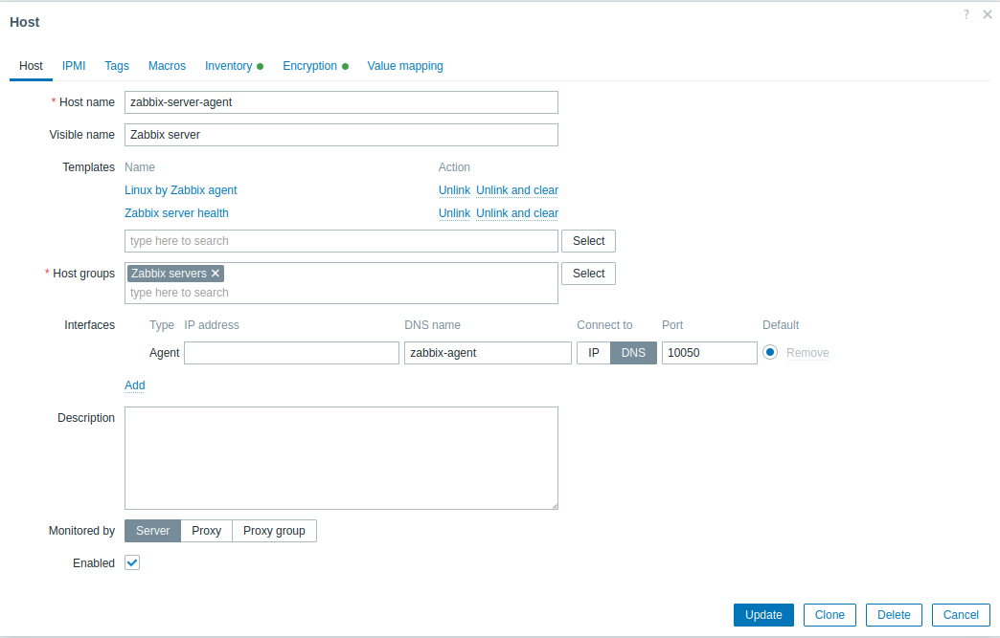

# Zabbix deployment repo

# Repo files:
 * [compose.yaml](compose.yaml): Definition of services.
 * [.env.example](.env.example): Example configuration of environmental variables.
 * **.env**: Must be crated based on [.env.example](.env.example) (gitignored).
 * [traefik_dynamic](traefik_dynamic): Configuration of traefik:
   * [admin-basicauth.yaml.example](traefik_dynamic/admin-basicauth.yaml.example): Example definition authorization with _basicauth_ used by traefik.
   * **admin-basicauth.yaml**: Must be created based on [admin-basicauth.yaml.example](traefik_dynamic/admin-basicauth.yaml.example) (gitignored).
   * [admin-clientscertauth.yaml](traefik_dynamic/admin-clientscertauth.yaml): Setups clients authorization by certificate.
   * [routers.yaml.example](traefik_dynamic/routers.yaml.example): Example definition of routers and acme.
   * **routers.yaml**: Must be crated based  [routers.yaml.example](traefik_dynamic/routers.yaml.example) (gitignored).
   * [services.yaml](traefik_dynamic/services.yaml): Defines services.
 * [traefik_public_certs](traefik_public_certs): Stores certificates shared via git:
   * [admin-clients-ca.crt](traefik_public_certs/admin-clients-ca.crt): Clients certificates CA.
 * [traefik_acme](traefik_acme):
   * _acme.josn_: Acme storage (autocreated, gitignored).
 * [mounted_scripts](mounted_scripts): Scripts executed inside containers.
   * [backup.sh](mounted_scripts/backup.sh): Backups script mounted to _mariadb_ container.
 * [scripts](scripts):
   * [db_backup.sh](scripts/db_backup.sh): Exec [backup.sh](mounted_scripts/backup.sh) inside _mariadb_ container.
   * [generate_psk.sh](scripts/generate_psk.sh): Generate PSK.
   * [generate_basicauth.sh](scripts/generate_basicauth.sh): Generate _basicauth_ token.
   * [zabbix_prod_start.sh](scripts/zabbix_prod_start.sh): Start production environment.
   * [zabbix_prod_stop.sh](scripts/zabbix_prod_stop.sh): Stop production environment.
   * [zabbix_traefik_restart.sh](scripts/zabbix_traefik_restart.sh): Restart traefik.
   * [zabbix-agent-restart.sh](scripts/zabbix_agent_restart.sh): Restart internal zabbix agent.
   * [zabbix_server_restart.sh](scripts/zabbix_server_restart.sh): Restart zabbix server.
   * [zabbix_phpmyadmin_start.sh](scripts/zabbix_phpmyadmin_start.sh): Start PhpMyAdmin.
   * [zabbix_phpmyadmin_stop.sh](scripts/zabbix_phpmyadmin_stop.sh): Stop PhpMyAdmin.

# Environmental variables

Documented in [.env](.env).

# Setup manual:

1. Clone repo.
2. Setup **.env**:
   * Use [generate_psk.sh](scripts/generate_psk.sh) to generate PSK for zabbix agent.
3. Setup **admin-basicauth.yaml**:
   * Use [generate_basicauth.sh](scripts/generate_basicauth.sh) to generate _basicauth_.
4. Setup **routers.yaml**.
5. Start system with [zabbix_prod_start.sh](scripts/zabbix_prod_start.sh).
6. Login to web using user "Admin" and password "Zabbix".
7. Change password.
8. In monitoring in _Zabbix Server_ set:

9. In monitoring in _Zabbix Server_ setup PSK in Encryption tab:
10. Optionally run [db_backup.sh](scripts/db_backup.sh) in cron once a day.
